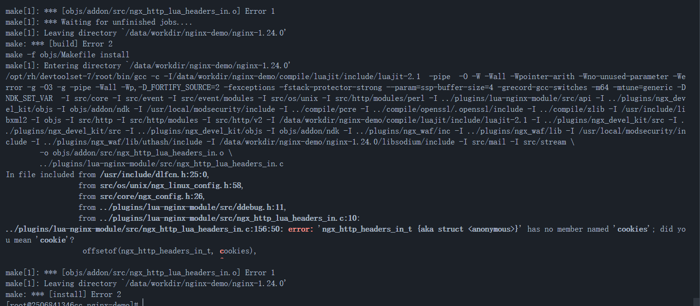

# waf

## 技术预研和选型
- [x] base ISO [openEuler-22.03-LTS-SP2-x86_64-dvd.iso](https://mirror.sjtu.edu.cn/openeuler/openEuler-22.03-LTS-SP2/ISO/x86_64/openEuler-22.03-LTS-SP2-x86_64-dvd.iso)
- [x] 直接使用 modsecurity 进行管理 
- [] 使用 nginx lua进行管理


## 开发使用
- 选型 https://github.com/ADD-SP/ngx_waf/
    - https://docs.addesp.com/ngx_waf/zh-cn/guide/installation.html#宝塔面板
- [nginx captcha](https://github.com/dengqiang2015/ngx_http_captcha_module/blob/master/ngx_http_captcha_module.c)
- [ngx_waf-20230811.tar.gz release](https://github.com/xx-zhang/ngx-sm2/releases/download/untagged-b9992d47734cd5a5f97f/nginx-11.tar.gz)


```bash
docker run -itd \
    --name waf \
    --net=host \
    -v $(pwd)/files/conf:/topnsm/nginx/conf/ \
    actanble/ngx_waf:v1

```

## 需要修改地方注意
- 常用的patch是下面的两个内容，我们经常用下面的一个。
```bash

patchelf --set-rpath lib64/ ./sbin/nginx 
patchelf --add-needed ./lib64/libfuzzy.so.2.1.0 ./sbin/nginx 
```


## 配置
- Update 20230817 
    - `ngx.var.modsec*` 相关参数不一定能直接传进去，如果没有就要想办法
    - 当前 modsecurity 的日志可以尝试通过 `secAction` 获取更多的变量，接着给到lua.


# 常见faq

## 问题1. 编译最新版本的lua-devel出错
- update ngx lua module to []`v0.10.25`](https://github.com/openresty/lua-nginx-module/releases/tag/v0.10.25)



## 问题2. 日志已经可以发送到c++ rest
- 日志可以用http接收，但是日志存储放在哪儿呢。如果是个web接口。具体应该怎么实现。
    - http+kcp 
