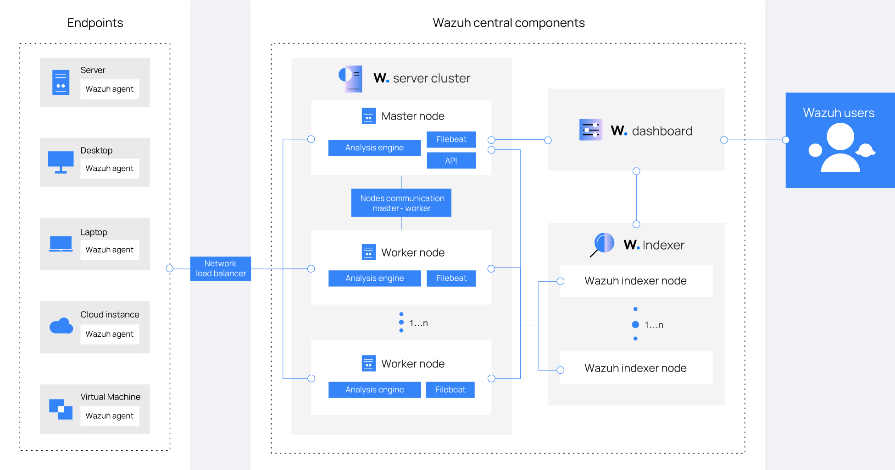

# 本项目说明
本项目使用 `wazuh-4.4` 做`siem`部署运营管理，打通相关部署的流程，实现siem核心功能的一些方案
- 日志采集
- 数据转换和标准化
- 安全事件分析
- 数据联动和富华
- 告警分析
- SOAR编排

## 架构说明
- https://documentation.wazuh.com/current/getting-started/architecture.html
- https://documentation.wazuh.com/3.8/getting-started/architecture.html

## 安装部署
- [install elk](https://documentation.wazuh.com/4.4/deployment-options/elastic-stack/all-in-one-deployment/index.html)
